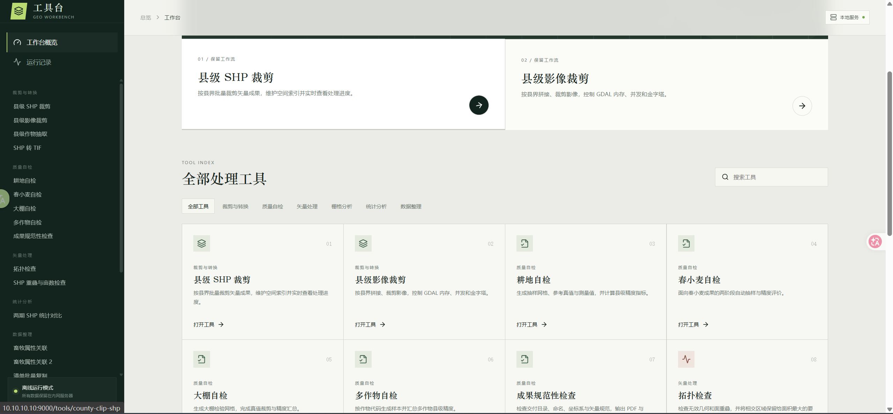
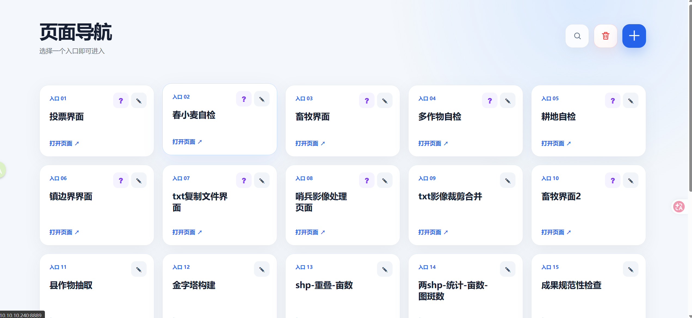
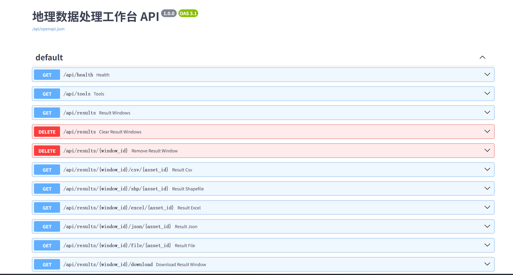

# 4NP 工具

4NP 工具是一套面向地理空间数据生产与质量检查的本地化工具集，覆盖矢量、栅格、行政区裁剪、成果自检、统计分析和数据整理等常用工作流。

项目提供两种使用界面：

- **统一工作台**：采用 React + FastAPI 的前后端架构，将常用工具集中到同一个页面中，统一完成参数配置、任务运行、日志查看和成果预览。
- **one-by-one 独立界面**：每个工具保留独立的轻量 Web 页面或脚本入口，可以按需单独部署和运行，适合已有流程、单机使用和工具级调试。

## 界面预览

### React 统一工作台



### one-by-one 独立界面



## 主要功能

统一工作台目前整合了以下类型的工具：

- **裁剪与转换**：县级 SHP 裁剪、县级影像裁剪、县级作物抽取、SHP 转 TIF。
- **质量自检**：耕地、春小麦、大棚和多作物自检，以及成果目录、命名、坐标系和矢量规范检查。
- **矢量处理**：拓扑检查、无效几何检查、图斑重叠与碎小图斑检查。
- **栅格分析**：分类投票、影像金字塔构建。
- **统计分析**：两期 SHP 面积、亩数和图斑数量对比。
- **数据整理**：畜牧属性关联、TXT 清单批量复制等。

React 工作台还提供任务状态管理、实时日志、运行记录、结果展示和代码浏览功能。FastAPI 负责工具目录、任务调度、进度事件和成果文件接口，具体 GIS 计算仍由各功能目录中的 Python 模块完成。

`one-by-one/` 中包含更多按工具拆分的独立版本，例如影像矫正、任务分发、镇级裁切、TXT 影像裁剪合并和页面导航等。这些工具不依赖统一 React 工作台，可分别启动。

## 项目结构

```text
4NP/
├─ backend/                    # FastAPI 接口、任务调度、工具适配和成果预览
├─ frontend/                   # React 统一工作台源码
│  └─ src/
├─ one-by-one/                 # 各工具的独立界面与独立运行版本
│  ├─ 页面导航/
│  ├─ 全内蒙县shp裁剪/
│  ├─ 全内蒙县影像裁剪/
│  ├─ 投票/
│  └─ ...
├─ 成果规范性检查/             # 各项 GIS 业务模块
├─ 县裁剪-shp/
├─ 县裁剪-tif/
├─ 投票/
├─ shp_to_tif/
├─ img/                        # README 界面截图
├─ pyproject.toml              # Python 项目与依赖声明
└─ uv.lock                     # Python 依赖锁文件
```

## 技术栈

- Python 3.13、FastAPI、Uvicorn
- React、Vite
- GeoPandas、Fiona、Rasterio、Shapely、PyProj
- Pandas、NumPy、OpenPyXL、Matplotlib
- SSE 实时任务事件与日志

## 运行统一工作台

### 1. 安装 Python 依赖

项目使用 [uv](https://docs.astral.sh/uv/) 管理 Python 环境：

```powershell
uv sync
```

### 2. 启动 FastAPI 后端

```powershell
uv run uvicorn backend.main:app --host 127.0.0.1 --port 9000
```

接口文档位于：<http://127.0.0.1:9000/api/docs>



### 3. 启动 React 开发界面

```powershell
cd frontend
npm install
npm run dev
```

开发页面默认由 Vite 提供，API 请求转发至 FastAPI 后端。生产使用时可先运行 `npm run build`，再由 FastAPI 或 Nginx 提供构建后的静态文件。

## 运行 one-by-one 独立界面

进入目标工具目录，根据该目录中的 README 和入口文件运行。不同工具的入口可能是 `app.py`、`main.py`、`web_server.py` 或其他业务脚本。

例如启动页面导航：

```powershell
cd one-by-one/页面导航
uv run python web_server.py
```

然后访问 <http://127.0.0.1:8080>。页面导航可以集中维护各独立工具的访问入口。

其他独立工具通常可按以下方式运行：

```powershell
cd one-by-one/目标工具目录
uv sync
uv run python app.py
```

请以对应目录中的 README 或实际入口文件为准。

## 数据与配置说明

本仓库面向公开提交进行了脱敏处理：

- 行政区边界文件仅保留目录结构和原始文件名，文件内容为空。
- JSON 和前端配置中的实际值已清空。
- 虚拟环境、前端依赖、缓存、构建产物和原 Git 历史未包含在仓库中。

运行前需要自行补充合法的数据文件、路径、服务地址和配置值。Shapefile 通常由 `.shp`、`.shx`、`.dbf`、`.prj` 等多个同名文件共同组成，请完整替换对应的占位文件。


